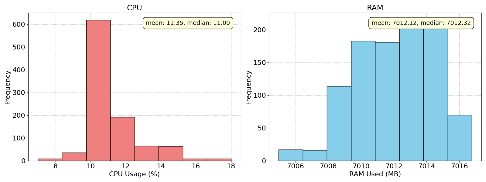
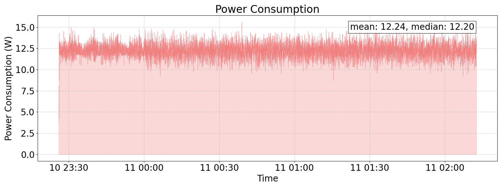

# CPU/RAM & power consumption extraction for a given processing task

This repository contains scripts and tools for extracting CPU/RAM and power consumption while a processing task is being carried. The selected processing task is a video streaming transmission (making use of ffmpeg open source tool), although any other app could be executed, and the CPU/RAM & power consumption extraction should work without being affected. For the power consumption extraction in specific, a smart plug (Shelly Plug S) is being used. Such device sends the consumption periodically via MQTT, which could be extracted using the monitor_power_consumption script.

Such repository is under the context of the EU-funded [XGAIN Project](https://xgain-project.eu/). In specific, such work is under the umbrella of the dry-run lab testing actitivies for a Use Case (UC) where drones provide edge-based streaming services over 5G.

## Directory Structure

```plaintext
.
├── README.md
├── results
│   ├── cpu_ram
│   │   ├── cpu_ram_histogram_example.png
│   │   └── cpu_ram_histogram_example.log
│   ├── power_consumption
│   │   ├── power_consumption_example.png
│   │   └── power_consumption_example.log
└── scripts
    ├── generate_plot_power_consumption.sh
    ├── generate_plots_cpu_ram.sh
    ├── install_dependencies.sh
    ├── monitor_cpu_ram.sh
    ├── monitor_power_consumption.sh
    ├── plot_cpu_ram.py
    ├── plot_power_consumption.py
    ├── run_experiment.sh
    └── start_streaming.sh
```

## Example Plots generated by the scripts

### CPU and RAM Usage Histogram


### Power Consumption Over Time


## Setting Up the Environment

1. **Install Dependencies**:
    ```bash
    cd scripts
    ./install_dependencies.sh
    ```

2. **Activate the Virtual Environment**:
    ```bash
    source venv/bin/activate
    ```

3. **Deactivate the Virtual Environment**:
    ```bash
    deactivate
    ```

## Run the experiment (video streaming transmission and KPIs extraction)
1. **Run the Experiment**:
    ```bash
    ./run_experiment.sh
    ```

## Manual execution of the different scripts (Alternative)
1. **Start the Streaming**:
    ```bash
    ./start_streaming.sh
    ```

2. **Monitor CPU and RAM Usage**:
    ```bash
    ./monitor_cpu_ram.sh
    ```

3. **Monitor Power Consumption**:
    ```bash
    ./monitor_power_consumption.sh
    ```

4. **Generate CPU and RAM Usage Plots**:
    ```bash
    ./generate_plots_cpu_ram.sh
    ```

5. **Generate Power Consumption Plot**:
    ```bash
    ./generate_plot_power_consumption.sh
    ```

## Notes
- For the power consumption KPI, configure the MQTT broker settings in the `monitor_power_consumption.sh` script.
- Adjust the video streaming parameters in the `start_streaming.sh` script as needed.
