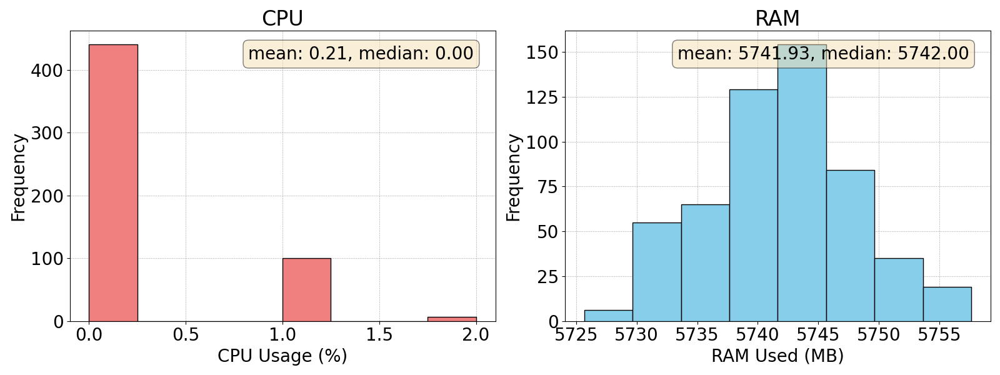
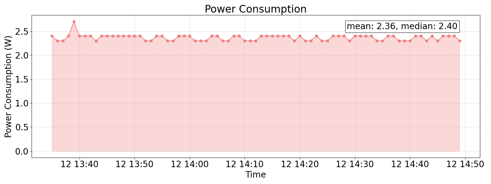

# Computing metrics extraction for a given processing task

This repository contains scripts and tools for extracting CPU/RAM and power consumption while a processing task is being carried. The selected processing task is a video streaming transmission (making use of ffmpeg9, although any other app could be executed, and the CPU/RAM & power consumption extraction should work without being affected. For the power consumption extraction in specific, a smart plug (Shelly Plug S) is being used. Such device sends the consumption periodically via MQTT, which could be extracted using the monitor_power_consumption script.

Such repository is under the context of the project XGAIN which has been funded by the European Union. In specific, is under the umbrella of the dry-run lab testing actitivies for a use case where a drones will provide streaming services over 5G. Such streaming should be processed in the Edge.

## Directory Structure

```plaintext
.
├── results
│   ├── cpu_ram_histogram_example.png
│   └── power_consumption_example.png
└── scripts
    ├── generate_plot_power_consumption.sh
    ├── generate_plots_cpu_ram.sh
    ├── install_dependencies.sh
    ├── monitor_cpu_ram.sh
    ├── monitor_power_consumption.sh
    ├── plot_cpu_ram.py
    ├── plot_power_consumption.py
    ├── run_experiment.sh
    └── start_streaming.sh
```

## Example Plots

### CPU and RAM Usage Histogram


### Power Consumption Over Time



## Scripts

### `install_dependencies.sh`

This script sets up the Python virtual environment and installs the necessary dependencies for running the other scripts.

**Usage:**
```bash
./install_dependencies.sh
```

### `monitor_cpu_ram.sh`

This script monitors and logs the CPU and RAM usage of the system. It logs the data every second to a file in the `../results` directory. The log file is named based on the current date and time.

**Usage:**
```bash
./monitor_cpu_ram.sh
```

**Log File Format:**
```plaintext
DateTime,CPU_Idle(%),Memory_Used(KB),Memory_Free(KB)
```

### `monitor_power_consumption.sh`

This script monitors and logs the power consumption of a device via MQTT. It connects to the specified MQTT broker, subscribes to the power consumption topic, and logs the data to a file in the `../results/` directory. The log file is named based on the current date and time.

**Usage:**
```bash
./monitor_power_consumption.sh
```

**Log File Format:**
```plaintext
DateTime,Power_Consumption(W)
```

**MQTT Configuration:**
- `MQTT_BROKER_IP`: IP address of the MQTT broker.
- `MQTT_USER`: MQTT username.
- `MQTT_PASSWORD`: MQTT password.
- `MQTT_TOPIC`: MQTT topic for power consumption.

### `start_streaming.sh`

This script starts streaming a video file using FFmpeg. The streaming parameters, including the video file path, streaming duration, receiver IP, and port, can be configured within the script.

**Usage:**
```bash
./start_streaming.sh
```

**Streaming Parameters:**
- `STREAMING_TIME`: Duration for which the video should be streamed.
- `VIDEO_PATH`: Path to the video file.
- `VIDEO_NAME`: Name of the video file.
- `STREAMING_RECEIVER_IP`: IP address of the streaming receiver.
- `STREAMING_RECEIVER_PORT`: Port of the streaming receiver.
- `STREAM_NAME`: Name of the stream.

### `generate_plot_power_consumption.sh`

This script generates a plot for power consumption from log files located in the `../results` directory. It calls the `plot_power_consumption.py` script to create the plot.

**Usage:**
```bash
./generate_plot_power_consumption.sh
```

### `generate_plots_cpu_ram.sh`

This script generates histograms for CPU and RAM usage from log files located in the `../results` directory. It calls the `plot_cpu_ram.py` script to create the plots.

**Usage:**
```bash
./generate_plots_cpu_ram.sh
```

### `plot_cpu_ram.py`

This Python script generates histograms for CPU and RAM usage from the provided log files directory. It processes the log files and creates side-by-side histograms showing the distribution of CPU and RAM usage.

**Usage:**
```bash
python3 plot_cpu_ram.py <path_to_log_files_directory>
```

**Log File Format:**
```plaintext
DateTime,CPU_Idle(%),Memory_Used(KB),Memory_Free(KB)
```

**Histograms:**
- **CPU Usage Histogram:** Shows the distribution of CPU usage.
- **RAM Usage Histogram:** Shows the distribution of RAM usage.

### `plot_power_consumption.py`

This Python script generates a plot for power consumption over time from the provided log files directory. It processes the log files and creates a plot showing power consumption over time, with the area under the curve filled and mean and median values displayed.

**Usage:**
```bash
python3 plot_power_consumption.py <path_to_log_files_directory>
```

**Log File Format:**
```plaintext
DateTime,Power_Consumption(W)
```

**Plot:**
- **Power Consumption Over Time:** Shows the power consumption over time with the area under the curve filled.

### `run_experiment.sh`

This script orchestrates the running of a streaming experiment. It starts the streaming process, monitors CPU and RAM usage, and generates plots after the experiment is completed. It uses `start_streaming.sh` to start the streaming and `monitor_cpu_ram.sh` to monitor the system performance.

**Usage:**
```bash
./run_experiment.sh
```

## Setting Up the Environment

1. **Install Dependencies**:
    ```bash
    cd scripts
    ./install_dependencies.sh
    ```

2. **Activate the Virtual Environment**:
    ```bash
    source venv/bin/activate
    ```

3. **Deactivate the Virtual Environment**:
    ```bash
    deactivate
    ```

## Run the experiment (video streaming transmission and KPIs extraction) 
1. **Run the Experiment**:
    ```bash
    ./run_experiment.sh
    ```

## Manual execution of the different scripts (Alternative)

1. **Start the Streaming**:
    ```bash
    ./start_streaming.sh
    ```

2. **Monitor CPU and RAM Usage**:
    ```bash
    ./monitor_cpu_ram.sh
    ```

3. **Monitor Power Consumption**:
    ```bash
    ./monitor_power_consumption.sh
    ```

4. **Generate CPU and RAM Usage Plots**:
    ```bash
    ./generate_plots_cpu_ram.sh
    ```

5. **Generate Power Consumption Plot**:
    ```bash
    ./generate_plot_power_consumption.sh
    ```

## Notes

- For the power consumption KPI, configure the MQTT broker settings in the `monitor_power_consumption.sh` script.
- Adjust the video streaming parameters in the `start_streaming.sh` script as needed.

## License

This project is licensed under the MIT License.
